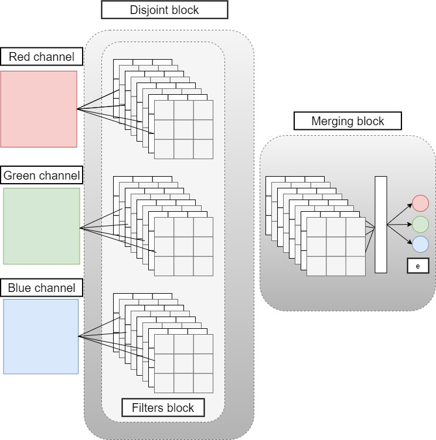
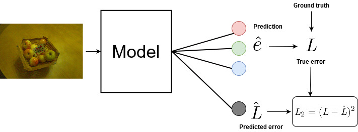
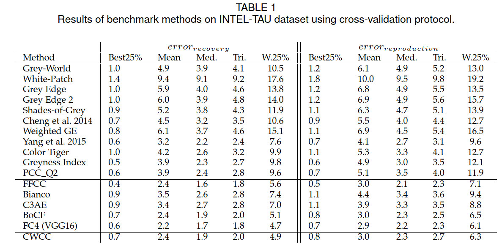
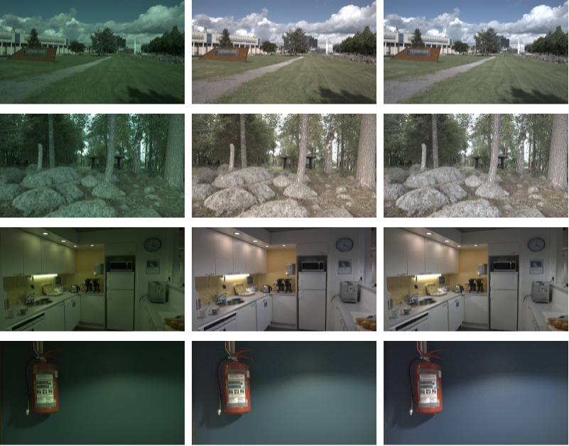

# Description
This repository provides the official implimentation of the illuminant estimation algorithm **CWCC** proposed in paper *[Robust channel-wise illumination estimation](https://arxiv.org/abs/2111.05681)* accepted in *[BMVC 2021](https://www.bmvc2021.com/)*. 


# CWCC
*Abstract:* 

Recently, Convolutional Neural Networks (CNNs) have been widely used to solve the illuminant estimation problem and have often led to state-of-the-art results. Standard approaches operate directly on the input image. In this paper, we argue that this problem can be decomposed into three channel-wise independent and symmetric sub-problems and propose a novel CNN-based illumination estimation approach based on this decomposition. The proposed method substantially reduces the number of parameters needed to solve the task while achieving competitive experimental results compared to state-of-the-art methods. Furthermore, the practical application of illumination estimation techniques typically requires identifying the extreme error cases. This can be achieved using an uncertainty estimation technique. In this work, we propose a novel color constancy uncertainty estimation approach that augments the trained model with an auxiliary branch which learns to predict the error based on the feature representation. Intuitively, the model learns which feature combinations are robust and are thus likely to yield low errors and which combinations result in erroneous estimates. We test this approach on the proposed method and show that it can indeed be used to avoid several extreme error cases and, thus, improves the practicality of the proposed technique.


*Motivation:* 

Formally, RGB values of an image  at every pixel   are expressed as a function of the global illuminant , the original colors $\textbf{R}(x,y)$ as follows:


where  is element-wise multiplication. Illumination estimation refers to the problem of estimating  given an input . Most CNN-based illuminant estimation approaches operate directly on the input image  without exploiting the specificities and characteristics the aforementioned equation defining the problem. In fact, it is easy to see that the illumination estimation problem can be divided into three problems using the color channels (r,g,b):


We note that the sub-equations in this decomposition are linear and symmetric, i.e., the problem defined in each equation is similar. We propose a novel CNN-based illuminant estimation approach, called **CWCC**, which leverages the decomposition enabling us to reduce the number of parameters up to 90\%.

*Channel-wise color constancy:* 

**CWCC** is composed of two blocks, the disjoint block and the merging block. The disjoint block learns to solve each sub-equation separately. To this end, each color channel has a separate CNN sub-model. Moreover, we exploit the symmetry of the sub-problems by sharing the weights of  'filter blocks' of the three sub-models.  In the merging block,  we concatenate the outputs of each channel of the first block. Then, we use a model which acts on this mixed representation and aims to learn the optimal way to merge the feature maps of each channel and approximate the illuminant .
<p align="center">
  
</p>

*Uncertainty estimation:*

For the practical use of illuminant estimation techniques, it is important to be able to identify  when the model will fail and when its prediction for a given scene is not reliable. We propose to augment our trained illuminant estimation model to predict the model uncertainty. We add an additional branch linked to the last intermediate layer which aims to learn to predict the error based on the feature representation. Intuitively, the model learns which feature combinations are robust and are thus likely to yield low errors and which combinations result in erroneous estimates.  The predicted error can be seen as an uncertainty estimate as it directly quantifies to expected loss. Similar to an uncertainty measure, it is expected to have high values in the case of high errors and lower values in the case of low errors.
<p align="center">
  
</p>
Given an input image, we generate two outputs: the main illuminant prediction and the predicted error using an auxiliary branch. As we have access to the ground-truth illuminations of our training samples, we can construct a training set for the additional branch by computing the true errors obtained by the trained illuminant estimation model. While training the uncertainty estimation block, we freeze the prediction part of the network to ensure a 'fixed' representation of every input sample and fine-tune only the additional branch of the network. 


# Usage

### INTEL-TAU Dataset
*[INTEL-TAU dataset](https://ieeexplore.ieee.org/document/9371681)* is the largest *[publicly available](http://urn.fi/urn:nbn:fi:att:f8b62270-d471-4036-b427-f21bce32b965)*  illumination estimation dataset. It is composed of 7022 scenes in total. The variety of scenes captured using three different camera models, i.e., Canon 5DSR, Nikon D810, and Sony IMX135, makes the dataset appropriate for evaluating the camera and scene invariance of the different illumination estimation techniques. 

### Dependencies 

The project was tested in Python 3. Run `pip install -r requirements.txt` to install dependent packages.

### Using our codes.
**1/** Download the preprossed 1080p TIFF variant of the dataset. 

**2/** Set the root path variable in main_training.py to your data path, e.g., 'root_path': '/mnt/Data/Firas2/Intel_v3/processed_1080p' 

**3/** Run the script  main_training.py : python3 main_training.py 

### Walking through the main code (main_training.py): 

**1/** First a dataset class is created using the paramters 

    inteltau = INTEL_TAU_DATASET(**dataset_params)
    inteltau.set_subsets_splits()

**2/** For each fold, we generate the split using the configuration file:

    partition,ground_truths = inteltau.get_train__test_10folds(fold)            

**3/** We augment the training and validation data relative to the current fold and save the augmented dataset relative to the fild in the aug_path. 
Note1:  This step is only excuted in case the augmented dataset folder does not exist.
Note2: Don't stop the code in the middle of this step. In case the code was stopped before this step is finished, the aug_path folder needs to be deleted manually. 

    augment_data(15*len(partition['train']),partition['train'],ground_truths['train'],(227,227),train_dir)    
    augment_data(5*len(partition['validation']),partition['validation'],ground_truths['validation'],(227,227),val_dir)  

**4/** We create a CWCC model with the corresponding input shape. We freeze the uncertainty estimation layers
    
     model = CWCC(input_shape= input_shape)
     
     for layer in model.layers:
          if layer.name[0:3]== 'var':
               layer.trainable = False
               print(layer.name)
            
     model.summary() 
     

**5/** Training the model and testing it using the test set

     history = model.fit(generator=training_generator, epochs=EPOCHS,
                            validation_data=validation_generator,
                            steps_per_epoch = (len(partition['train']) // train_params['batch_size']) ,                    
                            use_multiprocessing=True, 
                            callbacks =all_callbacks( path + '.hdf5' ),
                            workers=4)
     test_model(model,partition['test'],ground_truths['test'],method,path,result_path)
     
**6/** Training the uncertainty estimation block

     for layer in model.layers:
          layer.trainable = False
          print('phase2' + layer.name)
                            
     for layer in model.layers:
          if layer.name[0:3]== 'var':
               layer.trainable = True
               print(layer.name)
     history = model.fit(generator=training_generator, epochs=twoEPOCHS,
                                validation_data=validation_generator,
                                steps_per_epoch = (len(partition['train']) // train_params['batch_size']) ,                    
                                use_multiprocessing=True, 
                                callbacks =[savecsvlog2],
                                workers=16)

# Results
The numerical results of the different approaches on INTEL-TAU datasets. We report the different statistics of the Recovery and Reproduction errors using the 10-fold cross validation protocol. 
<p align="center">
  
</p>

We also provide some visual results of **CWCC** on three samples from INTEL-TAU. From left to right,  the input image, the corrected images with **CWCC** method, and the ground truth image.
<p align="center">
  
</p>


We also provide some visual results of uncertainty estimation on the test samples of the different INTEL-TAU folds. We report the predicted loss vs the true loss using the proposed approach. The correlation coefficients from fold 0 to 10 are: 0.47, 0.34, 0.24, 0.25, 0.34, 0.30, 0.45, 0.28, 0.33, and 0.31.

<p align="center">
  
</p> 

# Cite This Work

```
@article{laakom2021robust,
  title={Robust channel-wise illumination estimation},
  author={Laakom, Firas and Raitoharju, Jenni and Nikkanen, Jarno and Iosifidis, Alexandros and Gabbouj, Moncef},
  journal={arXiv preprint arXiv:2111.05681},
  year={2021}
}
```
